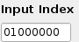

# LibreTX

  #### Create Bitcoin transactions without restrictions and better understand their contents


## LibreTX

LibreTX is a program that allows you to create Bitcoin transactions with input data that you manually provide.  Users can select a transaction type and enter their data for version, input index, transaction ID, the scriptpubkey to be signed, sequence, output amount and scriptpubkey addresses, private keys, hashtype and locktime.

This allows a User to not only manage their UTXO set and create a transaction comprising of various inputs and outputs that may be difficult with other Bitcoin software, but also allows the User to easily compare different transaction formats and better understand how the inputs translate to the final transaction.  

With the exception of the ECDSA and address decoding functions this was coded from scratch as both a way for me to learn all the subtilties of creating and signing the various varieties of Bitcoin transactions, and also to make life a little easier for those who want to learn more about transaction creation or even manually manage their UTXO set at a granular level. 

### This is intended as an educational tool and should not be treated as a secure tool to use for mainnet transactions

## Installation

### From Source:

At the command line:

```text
git clone https://github.com/coinsurenz/LibreTX
```

enter the LibreTX directory

Dependencies:

install the following dependecies with pip:

```text
pip install PyQt5 ecdsa pbkdf2
```

#### To Run

```text
python libre_tx.py
```

### Windows Users

A Windows .EXE executable is available in the releases section.  At this stage the included splash image and icon need to be located in the same directory as the exe file when it is run

## Usage

### A walkthrough video for each type of transaction can be found here:

[https://vimeo.com/350472108](https://vimeo.com/350472108)

### A start to finish explaination of how to send a transaction for absolute beginners:
[https://vimeo.com/350743738](https://vimeo.com/350743738)


* Select the transaction type that you wish to spend


* If the transaction is a segwit type \(P2SH/P2WSH, P2WPKH, P2WSH, P2WSH multisig\), enter the input transactions amount.  This is in regular decimal format\(1BTC= 1, 1.2BTC= 1.2, 4000 satoshis= 0.00004000 etc\).  There is no decimal point check so please ensure small amounts are entered correctly.    If this is not  a segwit transaction this information is not required and this field will remain greyed out. 


* Enter the index of the input transaction that is being spent, also known as the 'Output Index' 'Prevout Index' or 'VOUT'.  All 8 digits are required in hex format- \(index0 would be 00000000, index1 01000000, index 11- 0b000000 etc.\)



* Enter the txid of the transaction being spent.  This is in the big endian byte order that you will be provided in a bitcoin wallet or used in a bitcoin explorer \(eg the [coinbase transaction](https://blockstream.info/tx/4a5e1e4baab89f3a32518a88c31bc87f618f76673e2cc77ab2127b7afdeda33b) from the genesis block is _**'4a5e1e4baab89f3a32518a88c31bc87f618f76673e2cc77ab2127b7afdeda33b'**_ not '_**3ba3edfd7a7b12b27ac72c3e67768f617fc81bc3888a51323a9fb8aa4b1e5e4a**_' etc.  LibreTX will automatically convert this to the little endian format used in the final transaction.


* Enter the scriptpubkey or the redeemscript of the input transaction you are signing, including the length byte\(s\).  For example -  A pay to pubkey hash input would have a scriptpubkey similar to this _**'1976a91499a8b9b0a5805b10c82063456149e987d67946a388ac'**_ \(length byte, OP\_DUP OP\_HASH160 OP\_PUSHBYTES\_20 hash of pubkey, OP\_EQUALVERIFY OP\_CHECKSIG\)  A pay to scripthash input with a redeem script composing of push bytes, the pubkey and checksig would be simmilar to this '_**232103b096e190ef256e2d5604f269a159eba2ab4c6b84199543b285ba50d049bfbfb1ac**_' \(length byte, push bytes, unhashed pubkey, OP\_CHECKSIG\)  A redeemscript for a 7/9 P2WSH multisig would be simmilar to this _**"fd35015721033a69d0acd6e9500844ca078fbc4d81b6c95d7967b3106e31618d5987633d41a92103775ebfa3681adf4bbc6b19d3de2d4d6b911c180be46c9aca8128d428c7a0e0a821039c96c76acfc3928c36b0ea7d9eea07341adbb3d136c533637dd8c91302b6124321024ddb9f960f2be05a64003425c8b950f210facaedb6bf6013e312a886e8203f8e2103c4ee22899397090be13a863238540eac1a66eafff5af8043d1e1ac85fa3d7afe2103ed4ed9e3a1429ce6bd600f8bf2adc8a686f5904b4048f380f1f537533c79ddee2103892acabb43e58a1a7cf9db517dcb7fb07d40c1da7df6b12b1c351e8f15df52ed2102ecc2f4478e3ad1911e787b2b4f107e54725c06a808a9ce65950f588fe55930b421035264efd8fe1cc1f8f4a051d4809bcf320fbe2ce58137ffe967b14cb490e8102f59ae**_ \(length bytes in varint format, OP\_7, 9xpubkey preceeded by length byte, OP\_9, OP\_CHECKMULTISIG\)  If in doubt- examples of the appropriate information for this field are generated in my [BIP39 Key GUI app](https://github.com/coinsurenz/btc-key-gui)


* Enter the nSequence bytes.  The User may enter what ever values they like in this field but they must be hex values  to be accepted and 4 bytes/8 characters \(eg- feffffff\) for the transaction to be valid.


* The number of inputs and outputs.  The output selection box will unlock the relevant number of input fields for output information.  The input box is only used for the appropriate value when creating the transaction. Input fields are unlocked by selecting the approriate transaction type.  


* Enter the output amount\(s\).   input the amount you wish to pay each output scriptpubkey (more commonly known as a Bitcoin address).  This is in the same format as the **Txin Amounts** above. As LibreTX has no connection to the blockchain it is the User's responsibility to ensure these are below the total input amount for the transaction to be valid.  As with any Bitcoin transaction the fee paid is implied by the difference between the total inputs and the total outputs.  The final transaction printout will display the transaction size, so if you wish to calculate a satoshi per byte fee you can enter a dummy amount here, calculate the size of the final transaction, ensure that the total outputs are exactly this amount less than the inputs then re-generate the transaction with the correct output amounts.


* Enter the output script pubkeys \(AKA the address to send to\). These can either be in regular address format eg _**'17SkEw2md5avVNyYgj6RiXuQKNwkXaxFyQ'**_  or in the scriptpubkey format they will appear as in the transaction eg _**'1976a914fd2346fefc4f96fea5acc63dabfd17bdb9bb32a688ac'**_.  The format of your chosen output format needs to be selected in the **Output Address Format** box in the top righthand corner.  My [BIP39 Key GUI app](https://github.com/coinsurenz/btc-key-gui) can also help generating the relevant information here.  


* Enter the private key\(s\).  The private key to sign the input goes here.  if the transaction is a multisig then the keys should be placed in the correct sequence \(matching the order of the public keys in the redeemscript\) and separated by commas, eg _**'cQCrEkWgrw7rXH72NQCXJkWtkoLbhNBPRmgV5uiN4oQxANAVi6MJ, cQTPWQNW82RmevvQqChTGE9p3n973pp96hPEKevb8pWoDnwbViiN, cSJf2jqqMRLpib82bTfdrCSujJdKJ6jf9fwzdK9zYeD9Mfwzu42j'**_ These keys can either be in WIF \(eg _**cQCrEkWgrw7rXH72NQCXJkWtkoLbhNBPRmgV5uiN4oQxANAVi6MJ\),**_  hexidecimal **\(**eg _**4e454f3db020632007d213a02f94a113b14d85e5660c45c9258bfaea7050a779**\)  or scalar integer \( eg _**35402861538030916620638799369775481619777895860773336054543324930272908060537**_\) format.  The User should select the matching format in the ****Priv key format**** box.  This format needs to be the same for all privkeys.  


* Enter the Locktime.  This value is 4 bytes/8 characters and will appear in the final transaction as it is typed here.  If you wish to enter a specific blockheight or UNIX time for this value you can enter it in the **Block hgt/UNIX Time** field and click the **Convert L-Time** button.  This will set the locktime field to the correct hex value for the integer entered in this field.


* Enter the Hashtype.  This value is 4 bytes/8 characters and will be used as entered when the transaction is being signed.  For example SIGHASH\_ALL would be '_**01000000**_' , SIGHASH\_SINGLE \| SIGHASH\_ANYONECANPAY would be _**'83000000'**_


* Enter the Version bytes.  This value is 4 bytes/8 characters.


* Click the Sign Button to finalise the transaction.  This will compile the inputs you have entered and create a finalised signed transaction.


* Your transaction will be displayed in the Output Box.  The sections of the transaction themself are colour coded to make it easier for the User to identify the different components of the transaction.  Those that are unfamilair with the protocol may wish to note that due to the way the witness component of a transaction is composed and the colour coding scheme used it may be easy to confuse the blank scriptsig of a non segwit transaction "00" with the witness items section of another transaction, these are always 1 byte/2 characters in length for reference.  Also displayed is the TXID and the size information for the transaction so the User may determine an appropriate transaction fee or familarise themselves with the way certain transaction types can affect the final size.    This output can then be copied and transmitted via other applications such as Electrum, Bitcoin Core, Samourai Wallet, Txtenna or a website such as [Blockcypher](https://live.blockcypher.com/btc-testnet/pushtx/).


## Links for further reading
If you'd like to read up a little more about the components used in constructing a transaction here are some handy links

[Transaction Data](https://learnmeabitcoin.com/glossary/transaction-data).<br>
[Transactions- Bitcoin Wiki](https://en.bitcoin.it/wiki/Transaction).<br>
[Input Index](https://learnmeabitcoin.com/glossary/vout).<br>
[Script Pubkey](https://learnmeabitcoin.com/glossary/scriptPubKey).<br>
[Sequence](https://en.bitcoinwiki.org/wiki/NSequence).<br>
[Sighash Types](https://raghavsood.com/blog/2018/06/10/bitcoin-signature-types-sighash).<br>
[Locktime](https://learnmeabitcoin.com/glossary/locktime).<br>
[What is Segwit](https://learnmeabitcoin.com/faq/segregated-witness).<br>
[Mastering Bitcoin by Andreas M. Antonopoulos](https://github.com/bitcoinbook/bitcoinbook).<br>
[Programming Bitcoin by Jimmy Song](https://github.com/jimmysong/programmingbitcoin).<br>


